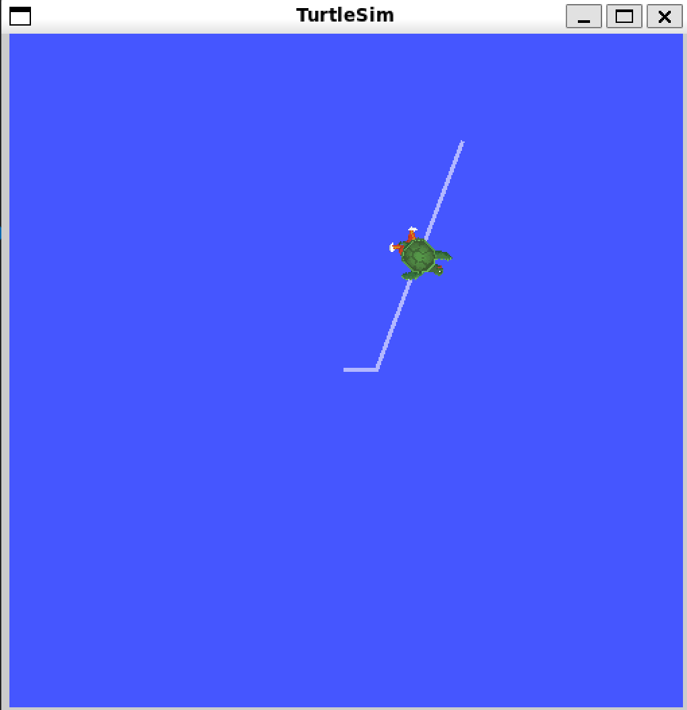
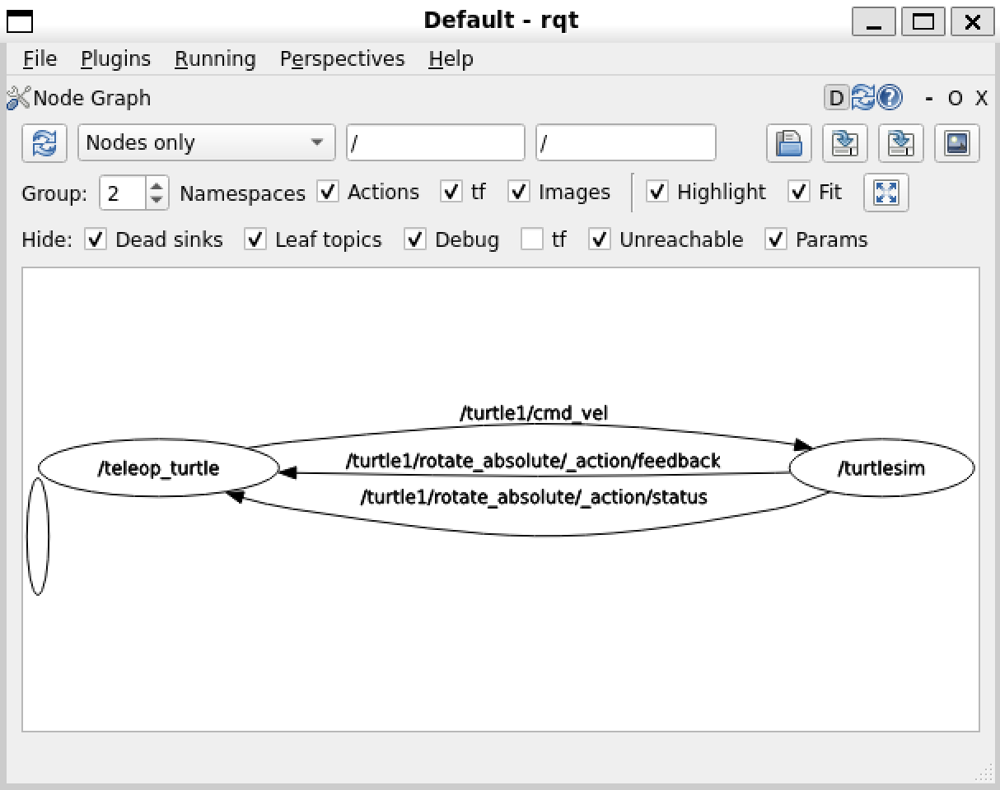

> 开发环境  
> - 主机系统：Windows 11 25H2  
> - WSL2 发行版：Ubuntu 22.04 LTS  
> - ROS 2 版本：Humble  

本文记录了一次在 WSL2 环境下为 Ubuntu 22.04 安装 ROS 2 Humble 的完整流程，并附带最简运行测试，确保安装成功。

## 1. 安装 ROS 2 Humble

官方文档给出了二进制包的安装方式，步骤如下[^1]：

1. 启用 universe 仓库并更新软件列表  
   ```bash
   sudo apt install software-properties-common
   sudo add-apt-repository universe
   sudo apt update && sudo apt install curl -y
   ```

2. 获取并安装 ROS 2 的 apt 源  
   ```bash
   export ROS_APT_SOURCE_VERSION=$(curl -s https://api.github.com/repos/ros-infrastructure/ros-apt-source/releases/latest  | grep -F "tag_name" | awk -F\" '{print $4}')
   curl -L -o /tmp/ros2-apt-source.deb "https://github.com/ros-infrastructure/ros-apt-source/releases/download/ ${ROS_APT_SOURCE_VERSION}/ros2-apt-source_${ROS_APT_SOURCE_VERSION}.$(. /etc/os-release && echo ${UBUNTU_CODENAME:-${VERSION_CODENAME}})_all.deb"
   sudo dpkg -i /tmp/ros2-apt-source.deb
   sudo apt update
   ```

3. 安装桌面版与开发工具  
   ```bash
   sudo apt install -y ros-humble-desktop
   sudo apt install -y ros-dev-tools
   ```

4. 将环境变量写入 `.bashrc`  
   ```bash
   echo "source /opt/ros/humble/setup.bash" >> ~/.bashrc
   source ~/.bashrc
   ```

5. 补齐 Python 依赖（PX4 开发推荐）  
   ```bash
   pip install --user -U empy==3.3.4 pyros-genmsg setuptools
   ```

至此，ROS 2 Humble 已就绪。

## 2. 运行海龟仿真验证

参考鱼香 ROS 入门教程[^2]，启动经典 turtlesim 进行验证：

1. 终端 1 启动仿真节点  
   ```bash
   ros2 run turtlesim turtlesim_node
   ```

2. 终端 2 启动键盘控制节点  
   ```bash
   ros2 run turtlesim turtle_teleop_key
   ```
   在此终端内使用方向键即可遥控海龟移动。

   

3. 保持上述两节点运行，再开一个终端启动 `rqt`：  
   ```bash
   rqt
   ```
   依次点击菜单栏 **Plugins → Introspection → Node Graph**，即可看到节点与话题的拓扑关系。

   

若海龟能正常移动且 Node Graph 显示完整，则安装无误，可进入后续开发，ROS2的架构与中间件理论参考资料[^3]。

## 3. 编译并运行第一个节点

### 3.1 纯 g++ 手动编译（Makefile）

```makefile
build:
	g++ first_ros2_node.cpp \
    -I/opt/ros/humble/include/rclcpp/ \
    -I /opt/ros/humble/include/rcl/ \
    -I /opt/ros/humble/include/rcutils/ \
    -I /opt/ros/humble/include/rmw \
    -I /opt/ros/humble/include/rcl_yaml_param_parser/ \
    -I /opt/ros/humble/include/rosidl_runtime_c \
    -I /opt/ros/humble/include/rosidl_typesupport_interface \
    -I /opt/ros/humble/include/rcpputils \
    -I /opt/ros/humble/include/builtin_interfaces \
    -I /opt/ros/humble/include/rosidl_runtime_cpp \
    -I /opt/ros/humble/include/tracetools \
    -I /opt/ros/humble/include/rcl_interfaces \
    -I /opt/ros/humble/include/libstatistics_collector \
    -I /opt/ros/humble/include/statistics_msgs \
    -L /opt/ros/humble/lib/ \
    -lrclcpp -lrcutils \
    -o first_node

clean:
	rm first_node
```

执行编译：

```bash
make build
```

### 3.2 CMake 方式（推荐）

`CMakeLists.txt`：

```cmake
cmake_minimum_required(VERSION 3.22)
project(first_node)

find_package(rclcpp REQUIRED)
add_executable(first_node first_ros2_node.cpp)
target_link_libraries(first_node rclcpp::rclcpp)
```

构建：

```bash
mkdir build && cd build
cmake ..
make
```

### 3.3 C++ 源码

`first_ros2_node.cpp`：

```cpp
#include "rclcpp/rclcpp.hpp"

int main(int argc, char **argv)
{
    rclcpp::init(argc, argv);
    rclcpp::spin(std::make_shared<rclcpp::Node>("first_node"));
    return 0;
}
```

运行：

```bash
./first_node
```

## 4. Python 版节点（单行脚本）

`second_ros2_node.py`：

```python
import rclpy
from rclpy.node import Node

rclpy.init()
rclpy.spin(Node("second_node"))
```

启动：

```bash
python3 second_ros2_node.py
```

## 5. 验证节点列表

新终端执行：

```bash
ros2 node list
```

预期输出：

```
/first_node
/second_node
```

Python 打包工具理论知识参考资料[^4]。

[^1]: [ROS 2 Humble deb 安装官方文档](https://docs.ros.org/en/humble/Installation/Ubuntu-Install-Debs.html)  
[^2]: [鱼香 ROS 2 介绍安装](https://fishros.com/d2lros2/#/humble/chapt1/get_started/4.ROS2%E5%88%9D%E4%BD%93%E9%AA%8C)  
[^3]: [鱼香 ROS 2 架构与中间件](https://fishros.com/d2lros2/#/humble/chapt1/advanced/1.ROS2%E7%B3%BB%E7%BB%9F%E6%9E%B6%E6%9E%84)  
[^4]: [Python 工具之 Setup.py 说明](https://fishros.com/d2lros2/#/humble/chapt2/basic/6.Python%E5%B7%A5%E5%85%B7%E4%B9%8BSetup)