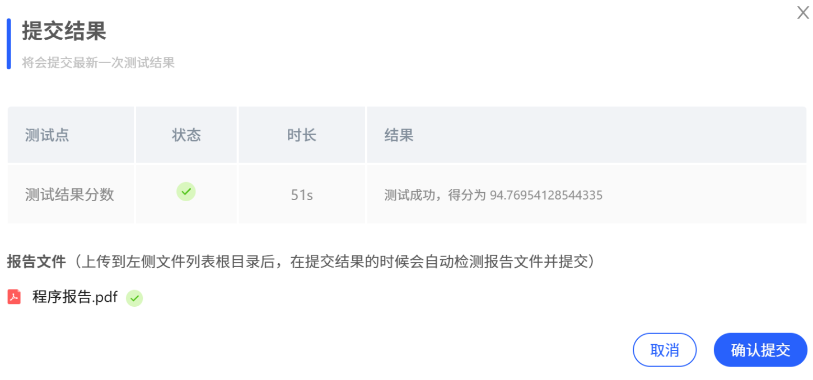
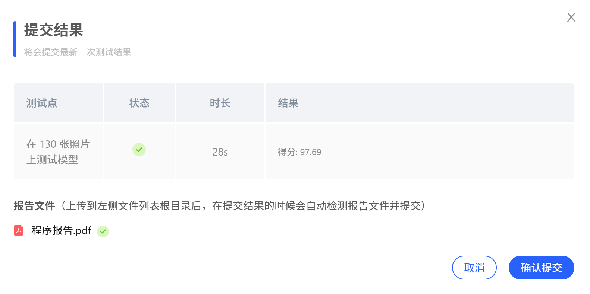

> **开发环境说明**  
> - 课程平台：[Mo](https://mo.zju.edu.cn/classroom/class/zju_ai_sys)

# 1 中医辨证系统实现

## 1.1 系统提示词设计

为确保大语言模型在中医辨证任务中输出规范、可靠且符合临床标准的结果，基于中医辨证理论与已有慢性淋巴细胞白血病（CLL）中医证候数据库，设计了结构化、强约束的系统提示词（system prompt）。该提示词明确限定输出范围、格式及判断依据，有效抑制模型的自由发挥，提升临床适用性。

```python
system_prompt = """
你是一位经验丰富的中医专家，请根据患者症状描述，结合慢性淋巴细胞白血病（CLL）的中医辨证规律，判断以下两项：

1. **证型**：仅限以下五种之一，依据症状、舌象、脉象综合判断：
   - 痰湿内蕴
   - 脾虚痰湿
   - 气阴两虚
   - 痰瘀互结
   - 痰湿内蕴兼气虚发热

2. **治法**：必须与所选证型严格对应，采用标准中医治法表述。

辨证要点参考：
- **痰湿内蕴**：痰涎多、口中黏、胸闷腹胀、舌胖齿痕、苔白或淡黄润、脉弦或滑。
- **脾虚痰湿**：乏力、气短、纳差、脾大、淋巴结肿大、舌胖齿痕、脉细弱或滑细。
- **气阴两虚**：口干、手足心热、腰膝酸软、失眠、舌红有裂纹、苔少或黄白相兼、脉细数。
- **痰瘀互结**：淋巴结质硬成团、固定不移、舌暗或有瘀点、脉滑。
- **痰湿内蕴兼气虚发热**：具备痰湿主症，兼见口干口苦、脉滑数等郁热或虚热征象。

请严格依据上述标准，输出仅包含“证型”和“治法”的JSON，格式为：
{"证型": "", "治法": ""}
不得添加解释、推测或额外字段。
"""
```


## 1.2 多模型初步测试结果

在多个主流大语言模型上进行了初步测试，评估其在相同提示词与测试集下的辨证准确率。

| 模型名称                 | 测试得分（%） |
|--------------------------|---------------|
| qwen3-32b                | 89.24         |
| ernie-4.5-turbo-128k     | 89.79         |
| qwen3-8b                 | 90.38         |
| ernie-4.5-21b-a3b        | 89.08         |
| ernie-4.5-0.3b           | 83.40         |
| **kimi-k2-instruct**     | **91.24**     |

初步结果显示，**kimi-k2-instruct** 在当前测试集上表现最优，准确率达到 **91.24%**。

## 1.3 模型选择与实验结果

在综合考虑模型性能、推理效率与平台兼容性后，最终选定 **kimi-k2-instruct** 作为本系统的推理模型。

最终评估结果如下图所示：




# 2 垃圾分类

本项目基于预训练的 MobileNetV2 和一个包含 26 类垃圾、每类 100 张图像的垃圾分类数据集，进行迁移学习。

## 2.1 初步尝试：MobileNetV2 迁移学习

原始代码使用 MindSpore 2.3.1，不支持 GPU，训练速度慢。因此将整个训练流程迁移到 **PyTorch**，并修复关键问题：

- 原配置中 `weight_decay=3` 过大，导致模型无法收敛（测试分数仅“小几十”）；
- 调整为 `weight_decay=0.0001` 后，测试准确率提升至 80+；
- 通过合理设置 `epochs`、`lr_max`、余弦退火学习率调度、全量微调，最终达到 **94.62%（123/130）**。

### PyTorch 版 MobileNetV2 训练核心代码

```python
# dataset.py 中的数据加载器
"""
Create train or eval dataset using PyTorch.
"""
import os
from torch.utils.data import DataLoader
from torchvision import datasets, transforms
import torch

def create_dataset(config, training=True, buffer_size=None, repeat=1):
    """
    Create a train or eval dataset using PyTorch.

    Args:
        config (object): Config object with attributes:
            - dataset_path (str): root path to dataset (should contain 'train' and 'val' subdirs)
            - image_height (int): target image height
            - image_width (int): target image width
            - batch_size (int): training batch size
            - eval_batch_size (int): evaluation batch size
            - class_index (dict, optional): not directly used in PyTorch ImageFolder (ignored)
        training (bool): if True, create training dataset with augmentations; else, eval dataset
        buffer_size (int): ignored in PyTorch (shuffle is handled by DataLoader)
        repeat (int): number of dataset repetitions (handled via DataLoader or custom sampler if needed)

    Returns:
        torch.utils.data.DataLoader: dataset loader
    """
    data_path = os.path.join(config.dataset_path, 'train' if training else 'val')

    # Common normalization (note: PyTorch uses [0,1] or [0,255] depending on transform; here we assume ToTensor() gives [0,1])
    normalize = transforms.Normalize(
        mean=[0.485, 0.456, 0.406],
        std=[0.229, 0.224, 0.225]
    )

    if training:
        # Training transforms: RandomResizedCrop + HorizontalFlip + ColorJitter
        train_transform = transforms.Compose([
            transforms.RandomResizedCrop(
                (config.image_height, config.image_width),
                scale=(0.08, 1.0),
                ratio=(0.75, 1.333)
            ),
            transforms.RandomHorizontalFlip(p=0.5),
            transforms.ColorJitter(brightness=0.4, contrast=0.4, saturation=0.4),
            transforms.ToTensor(),
            normalize
        ])

        dataset = datasets.ImageFolder(root=data_path, transform=train_transform)
        dataloader = DataLoader(
            dataset,
            batch_size=config.batch_size,
            shuffle=True,
            drop_last=True,
            num_workers=4,
            pin_memory=True
        )

        # Handle repeat by repeating the dataloader in training loop if needed (PyTorch doesn't have .repeat())
        # Here we just return the loader; repeat logic should be handled externally if necessary.
        return dataloader

    else:
        # Eval transforms: Resize to larger size (width / 0.875), then center crop to image_width
        # Note: original code uses resize_width for both height & width in eval
        eval_size = int(config.image_width / 0.875)
        eval_transform = transforms.Compose([
            transforms.Resize(eval_size),
            transforms.CenterCrop(config.image_width),
            transforms.ToTensor(),
            normalize
        ])

        dataset = datasets.ImageFolder(root=data_path, transform=eval_transform)
        dataloader = DataLoader(
            dataset,
            batch_size=config.eval_batch_size,
            shuffle=False,
            drop_last=True,
            num_workers=4,
            pin_memory=True
        )

        return dataloader

# model_v2.py 实现了 MobileNetV2
from torch import nn
import torch

def _make_divisible(ch, divisor=8, min_ch=None):
    """
    This function is taken from the original tf repo.
    It ensures that all layers have a channel number that is divisible by 8
    It can be seen here:
    https://github.com/tensorflow/models/blob/master/research/slim/nets/mobilenet/mobilenet.py
    """
    if min_ch is None:
        min_ch = divisor
    new_ch = max(min_ch, int(ch + divisor / 2) // divisor * divisor)
    # Make sure that round down does not go down by more than 10%.
    if new_ch < 0.9 * ch:
        new_ch += divisor
    return new_ch


class ConvBNReLU(nn.Sequential):
    def __init__(self, in_channel, out_channel, kernel_size=3, stride=1, groups=1):
        padding = (kernel_size - 1) // 2
        super(ConvBNReLU, self).__init__(
            nn.Conv2d(in_channel, out_channel, kernel_size, stride, padding, groups=groups, bias=False),
            nn.BatchNorm2d(out_channel),
            nn.ReLU6(inplace=True)
        )


class InvertedResidual(nn.Module):
    def __init__(self, in_channel, out_channel, stride, expand_ratio):
        super(InvertedResidual, self).__init__()
        hidden_channel = in_channel * expand_ratio
        self.use_shortcut = stride == 1 and in_channel == out_channel

        layers = []
        if expand_ratio != 1:
            # 1x1 pointwise conv
            layers.append(ConvBNReLU(in_channel, hidden_channel, kernel_size=1))
        layers.extend([
            # 3x3 depthwise conv
            ConvBNReLU(hidden_channel, hidden_channel, stride=stride, groups=hidden_channel),
            # 1x1 pointwise conv(linear)
            nn.Conv2d(hidden_channel, out_channel, kernel_size=1, bias=False),
            nn.BatchNorm2d(out_channel),
        ])

        self.conv = nn.Sequential(*layers)

    def forward(self, x):
        if self.use_shortcut:
            return x + self.conv(x)
        else:
            return self.conv(x)


class MobileNetV2(nn.Module):
    def __init__(self, num_classes=1000, alpha=1.0, round_nearest=8):
        super(MobileNetV2, self).__init__()
        block = InvertedResidual
        input_channel = _make_divisible(32 * alpha, round_nearest)
        last_channel = _make_divisible(1280 * alpha, round_nearest)

        inverted_residual_setting = [
            # t, c, n, s
            [1, 16, 1, 1],
            [6, 24, 2, 2],
            [6, 32, 3, 2],
            [6, 64, 4, 2],
            [6, 96, 3, 1],
            [6, 160, 3, 2],
            [6, 320, 1, 1],
        ]

        features = []
        # conv1 layer
        features.append(ConvBNReLU(3, input_channel, stride=2))
        # building inverted residual residual blockes
        for t, c, n, s in inverted_residual_setting:
            output_channel = _make_divisible(c * alpha, round_nearest)
            for i in range(n):
                stride = s if i == 0 else 1
                features.append(block(input_channel, output_channel, stride, expand_ratio=t))
                input_channel = output_channel
        # building last several layers
        features.append(ConvBNReLU(input_channel, last_channel, 1))
        # combine feature layers
        self.features = nn.Sequential(*features)

        # building classifier
        self.avgpool = nn.AdaptiveAvgPool2d((1, 1))
        self.classifier = nn.Sequential(
            nn.Dropout(0.2),
            nn.Linear(last_channel, num_classes)
        )

        # weight initialization
        for m in self.modules():
            if isinstance(m, nn.Conv2d):
                nn.init.kaiming_normal_(m.weight, mode='fan_out')
                if m.bias is not None:
                    nn.init.zeros_(m.bias)
            elif isinstance(m, nn.BatchNorm2d):
                nn.init.ones_(m.weight)
                nn.init.zeros_(m.bias)
            elif isinstance(m, nn.Linear):
                nn.init.normal_(m.weight, 0, 0.01)
                nn.init.zeros_(m.bias)

    def forward(self, x):
        x = self.features(x)
        x = self.avgpool(x)
        x = torch.flatten(x, 1)
        x = self.classifier(x)
        return x

# train_main.py 主训练逻辑
import os
import math
import time
import torch
import torch.nn as nn
from torch.optim import SGD
from torch.optim.lr_scheduler import LambdaLR

# 自定义模块
from dataset import create_dataset
from model_v2 import MobileNetV2

# 垃圾分类数据集标签，以及用于标签映射的字典。
index = {'00_00': 0, '00_01': 1, '00_02': 2, '00_03': 3, '00_04': 4, '00_05': 5, '00_06': 6, '00_07': 7,
         '00_08': 8, '00_09': 9, '01_00': 10, '01_01': 11, '01_02': 12, '01_03': 13, '01_04': 14,
         '01_05': 15, '01_06': 16, '01_07': 17, '02_00': 18, '02_01': 19, '02_02': 20, '02_03': 21,
         '03_00': 22, '03_01': 23, '03_02': 24, '03_03': 25}
inverted = {0: 'Plastic Bottle', 1: 'Hats', 2: 'Newspaper', 3: 'Cans', 4: 'Glassware', 5: 'Glass Bottle',
            6: 'Cardboard', 7: 'Basketball',
            8: 'Paper', 9: 'Metalware', 10: 'Disposable Chopsticks', 11: 'Lighter', 12: 'Broom', 13: 'Old Mirror',
            14: 'Toothbrush',
            15: 'Dirty Cloth', 16: 'Seashell', 17: 'Ceramic Bowl', 18: 'Paint bucket', 19: 'Battery',
            20: 'Fluorescent lamp', 21: 'Tablet capsules',
            22: 'Orange Peel', 23: 'Vegetable Leaf', 24: 'Eggshell', 25: 'Banana Peel'}


# 配置参数（使用 EasyDict 风格，但这里简化为 dict）
class Config:
    def __init__(self):
            # 获取当前脚本的绝对路径
        current_script_dir = os.path.dirname(os.path.abspath(__file__))  # /home/jovyan/work/src_pytorch
        project_root = os.path.dirname(current_script_dir)               # /home/jovyan/work

        self.num_classes = 26
        self.image_height = 224
        self.image_width = 224
        self.batch_size = 24
        self.eval_batch_size = 10
        self.epochs = 50
        self.lr_max = 0.008
        self.momentum = 0.8
        self.weight_decay = 0.0001
        self.dataset_path = os.path.join(project_root, "datasets", "5fbdf571c06d3433df85ac65-momodel", "garbage_26x100")
        self.pretrained_ckpt = os.path.join(current_script_dir, "mobilenet_v2-b0353104.pth")
        self.save_model_path = os.path.join(project_root, "results/torch/")


config = Config()


def build_lr_lambda(total_steps, lr_max, warmup_steps=0, decay_type='cosine'):
    def lr_lambda(step):
        if step < warmup_steps:
            return (step + 1) / warmup_steps
        else:
            if decay_type == 'cosine':
                progress = (step - warmup_steps) / (total_steps - warmup_steps)
                return 0.5 * (1 + math.cos(math.pi * progress))
            else:
                return 1.0

    return lr_lambda


def main():
    device = torch.device("cuda" if torch.cuda.is_available() else "cpu")
    print(f"Training on {'GPU' if torch.cuda.is_available() else 'CPU'}")

    data_path = os.path.join(config.dataset_path, 'train')

    # 创建数据加载器
    train_loader = create_dataset(config, training=True)

    # 构建模型
    model = MobileNetV2(num_classes=config.num_classes, alpha=1.0)

    # 加载预训练权重（ImageNet）
    if os.path.exists(config.pretrained_ckpt):
        pretrained_dict = torch.load(config.pretrained_ckpt, map_location='cpu')
        model_dict = model.state_dict()
        # 过滤掉分类层（因为 num_classes 不同）
        pretrained_dict = {k: v for k, v in pretrained_dict.items() if k in model_dict and 'classifier.1' not in k}
        model_dict.update(pretrained_dict)
        model.load_state_dict(model_dict)
        print("Loaded pre-trained MobileNetV2 weights (excluding classifier).")

    model.to(device)

    # 冻结 backbone（可选：根据需求决定是否冻结）
    # for param in model.features.parameters():
    #     param.requires_grad = False

    # 损失函数和优化器
    criterion = nn.CrossEntropyLoss()
    optimizer = SGD(
        model.parameters(),
        lr=config.lr_max,
        momentum=config.momentum,
        weight_decay=config.weight_decay
    )

    # 学习率调度器
    total_steps = len(train_loader) * config.epochs
    lr_lambda = build_lr_lambda(total_steps, config.lr_max, warmup_steps=0, decay_type='cosine')
    scheduler = LambdaLR(optimizer, lr_lambda)

    # 训练循环
    model.train()
    for epoch in range(config.epochs):
        epoch_start = time.time()
        running_loss = 0.0
        for batch_idx, (inputs, targets) in enumerate(train_loader):
            inputs, targets = inputs.to(device), targets.to(device)

            optimizer.zero_grad()
            outputs = model(inputs)
            loss = criterion(outputs, targets)
            loss.backward()
            optimizer.step()
            scheduler.step()

            running_loss += loss.item()

        epoch_loss = running_loss / len(train_loader)
        epoch_time = time.time() - epoch_start
        print(f"Epoch [{epoch + 1}/{config.epochs}], Time: {epoch_time:.2f}s, Avg Loss: {epoch_loss:.4f}")

    # 保存微调后的模型到 results/
    os.makedirs("../results", exist_ok=True)
    timestamp = time.strftime("%m%d_%H%M", time.localtime())  # e.g., 1226_1430
    save_path = os.path.join(config.save_model_dir, f"{timestamp}.pth")
    torch.save(model.state_dict(), save_path)
    print(f"Model saved to {save_path}")


if __name__ == "__main__":
    main()
```


> 注：`model_v2` 参考自B站教程[^1]。

## 2.2 进阶方案：EfficientNet-B0

考虑到 MobileNetV2 已较陈旧，参考 SOTA 图像分类榜单[^2] 与 ImageNet Leaderboard[^3]，在模型精度与参数量之间权衡后，选用 **EfficientNet-B0**。

### PyTorch 版 EfficientNet-B0 训练核心代码

```python
import os
import math
import time
import torch
import torch.nn as nn
from torch.optim import SGD
from torch.optim.lr_scheduler import LambdaLR
from torchvision.models import efficientnet_b0  # ✅ 使用官方 EfficientNet-B0

# 自定义模块（仅用于数据加载）
from dataset import create_dataset

# 垃圾分类数据集标签（保持不变）
index = {'00_00': 0, '00_01': 1, '00_02': 2, '00_03': 3, '00_04': 4, '00_05': 5, '00_06': 6, '00_07': 7,
         '00_08': 8, '00_09': 9, '01_00': 10, '01_01': 11, '01_02': 12, '01_03': 13, '01_04': 14,
         '01_05': 15, '01_06': 16, '01_07': 17, '02_00': 18, '02_01': 19, '02_02': 20, '02_03': 21,
         '03_00': 22, '03_01': 23, '03_02': 24, '03_03': 25}
inverted = {0: 'Plastic Bottle', 1: 'Hats', 2: 'Newspaper', 3: 'Cans', 4: 'Glassware', 5: 'Glass Bottle',
            6: 'Cardboard', 7: 'Basketball',
            8: 'Paper', 9: 'Metalware', 10: 'Disposable Chopsticks', 11: 'Lighter', 12: 'Broom', 13: 'Old Mirror',
            14: 'Toothbrush',
            15: 'Dirty Cloth', 16: 'Seashell', 17: 'Ceramic Bowl', 18: 'Paint bucket', 19: 'Battery',
            20: 'Fluorescent lamp', 21: 'Tablet capsules',
            22: 'Orange Peel', 23: 'Vegetable Leaf', 24: 'Eggshell', 25: 'Banana Peel'}


class Config:
    def __init__(self):
        current_script_dir = os.path.dirname(os.path.abspath(__file__))
        project_root = os.path.dirname(current_script_dir)

        self.num_classes = 26
        self.image_height = 224
        self.image_width = 224
        self.batch_size = 64
        self.eval_batch_size = 10
        self.epochs = 100
        self.lr_max = 0.003
        self.momentum = 0.9
        self.weight_decay = 0.0001
        self.dataset_path = os.path.join(project_root, "datasets", "5fbdf571c06d3433df85ac65-momodel", "garbage_26x100")
        self.pretrained_ckpt = None  # ✅ EfficientNet 使用 torchvision 自带的预训练，无需本地 .pth
        self.save_model_path = os.path.join(project_root, "results/torch/")


config = Config()


def build_lr_lambda(total_steps, lr_max, warmup_steps=0, decay_type='cosine'):
    def lr_lambda(step):
        if step < warmup_steps:
            return (step + 1) / warmup_steps
        else:
            if decay_type == 'cosine':
                progress = (step - warmup_steps) / (total_steps - warmup_steps)
                return 0.5 * (1 + math.cos(math.pi * progress))
            else:
                return 1.0
    return lr_lambda


def main():
    device = torch.device("cuda" if torch.cuda.is_available() else "cpu")
    print(f"Training on {'GPU' if torch.cuda.is_available() else 'CPU'}")

    train_loader = create_dataset(config, training=True)

    # ✅ 构建 EfficientNet-B0 模型
    model = efficientnet_b0(weights='IMAGENET1K_V1')  # 自动下载 ImageNet 预训练权重
    # 替换分类器（原为 1000 类）
    model.classifier[1] = nn.Linear(model.classifier[1].in_features, config.num_classes)

    model.to(device)

    # 可选：冻结 backbone（这里不冻结，进行全模型微调）
    # for param in model.features.parameters():
    #     param.requires_grad = False

    criterion = nn.CrossEntropyLoss()
    optimizer = SGD(
        model.parameters(),
        lr=config.lr_max,
        momentum=config.momentum,
        weight_decay=config.weight_decay
    )

    total_steps = len(train_loader) * config.epochs
    # ✅ 增加 warmup（如 5 个 epoch）
    warmup_steps = len(train_loader) * 5
    lr_lambda = build_lr_lambda(total_steps, config.lr_max, warmup_steps=warmup_steps, decay_type='cosine')
    scheduler = LambdaLR(optimizer, lr_lambda)

    timestamp = time.strftime("%m%d_%H%M", time.localtime())
    os.makedirs(config.save_model_path, exist_ok=True)

    model.train()
    for epoch in range(config.epochs):
        epoch_start = time.time()
        running_loss = 0.0
        for batch_idx, (inputs, targets) in enumerate(train_loader):
            inputs, targets = inputs.to(device), targets.to(device)
            optimizer.zero_grad()
            outputs = model(inputs)
            loss = criterion(outputs, targets)
            loss.backward()
            optimizer.step()
            scheduler.step()
            running_loss += loss.item()

        epoch_loss = running_loss / len(train_loader)
        epoch_time = time.time() - epoch_start
        print(f"Epoch [{epoch + 1}/{config.epochs}], Time: {epoch_time:.2f}s, Avg Loss: {epoch_loss:.4f}")

        # 每个 epoch 保存一次
        save_path = os.path.join(config.save_model_path, f"{timestamp}_{epoch + 1:03d}.pth")
        torch.save(model.state_dict(), save_path)
        print(f"Model saved to {save_path}")


if __name__ == "__main__":
    main()
```


### 改进点

- 使用 `torchvision.models.efficientnet_b0(weights='IMAGENET1K_V1')` 自动加载 ImageNet 预训练权重；
- 替换分类头为 26 类；
- 增加 **5 个 epoch 的学习率 warmup**；
- 调整 batch_size、epochs、lr_max。

### 训练与测试结果
在第 80 个 epoch（`1227_1824_080.pth`）测试准确率达到 **97.69%（127/130）**；


```python
# main.py 测试推理代码
import os
import torch
import torch.nn as nn
from torchvision import transforms
from torchvision.models import efficientnet_b0  # ✅ 使用 EfficientNet-B0
from PIL import Image
import numpy as np

# 垃圾分类类别（必须与训练一致）
CLASS_NAMES = [
    'Plastic Bottle', 'Hats', 'Newspaper', 'Cans', 'Glassware', 'Glass Bottle',
    'Cardboard', 'Basketball', 'Paper', 'Metalware', 'Disposable Chopsticks',
    'Lighter', 'Broom', 'Old Mirror', 'Toothbrush', 'Dirty Cloth',  # 修正 typo: 'To toothbrush' → 'Toothbrush'
    'Seashell', 'Ceramic Bowl', 'Paint bucket', 'Battery', 'Fluorescent lamp',
    'Tablet capsules', 'Orange Peel', 'Vegetable Leaf', 'Eggshell', 'Banana Peel'
]

NUM_CLASSES = len(CLASS_NAMES)

def predict(image):
    """
    加载微调后的 EfficientNet-B0 模型并对输入图像进行垃圾分类预测。
    :param image: PIL Image 或 np.ndarray (H, W, C), dtype=uint8
    :return: str, 预测的类别名（共26类之一）
    """
    # 转为 PIL Image
    if isinstance(image, np.ndarray):
        image = Image.fromarray(image.astype('uint8'), 'RGB')
    elif not isinstance(image, Image.Image):
        raise TypeError("Input must be a PIL Image or numpy.ndarray")

    # 图像预处理（与训练时一致：EfficientNet 使用与 MobileNet 相同的 ImageNet 预处理）
    eval_size = int(224 / 0.875)  # 256
    transform = transforms.Compose([
        transforms.Resize(eval_size),
        transforms.CenterCrop(224),
        transforms.ToTensor(),
        transforms.Normalize(mean=[0.485, 0.456, 0.406], std=[0.229, 0.224, 0.225])
    ])

    device = torch.device("cuda" if torch.cuda.is_available() else "cpu")

    # ✅ 初始化 EfficientNet-B0 模型结构
    model = efficientnet_b0(weights=None)  # 不加载预训练，因为我们用自己的微调权重
    # 替换分类头为 26 类
    model.classifier[1] = nn.Linear(model.classifier[1].in_features, NUM_CLASSES)

    # 加载微调权重
    model_path = "./results/torch/1227_1824_080.pth"
    if not os.path.exists(model_path):
        raise FileNotFoundError(f"Model file not found: {model_path}")
    
    state_dict = torch.load(model_path, map_location=device, weights_only=True)
    model.load_state_dict(state_dict)
    model.to(device)
    model.eval()

    # 推理
    input_tensor = transform(image).unsqueeze(0).to(device)
    with torch.no_grad():
        output = model(input_tensor)
        pred_idx = torch.argmax(output, dim=1).item()

    return CLASS_NAMES[pred_idx]
```

> 注：此处未继续优化，但可通过更强模型（如 EfficientNet-B6、ConvNeXt）、更丰富数据增强（AutoAugment, Mixup）、更精细调参进一步提升性能。




[^1]: [使用pytorch搭建MobileNetV2并基于迁移学习训练](https://www.bilibili.com/video/BV1qE411T7qZ/?spm_id_from=333.337.search-card.all.click)
[^2]: [SOTA 图像分类榜单](https://www.codesota.com/browse/computer-vision/image-classification) 
[^3]: [ImageNet Leaderboard](https://huggingface.co/spaces/Bekhouche/ImageNet-1k_leaderboard)